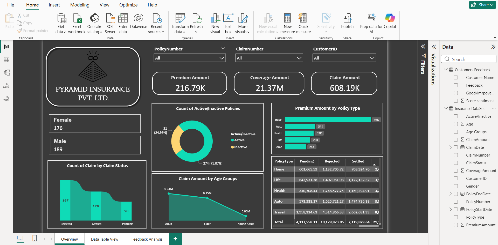
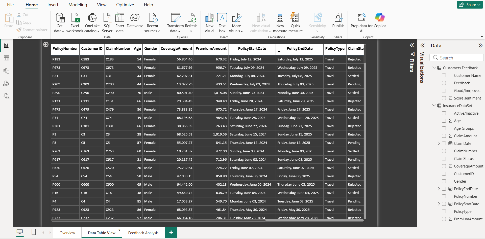
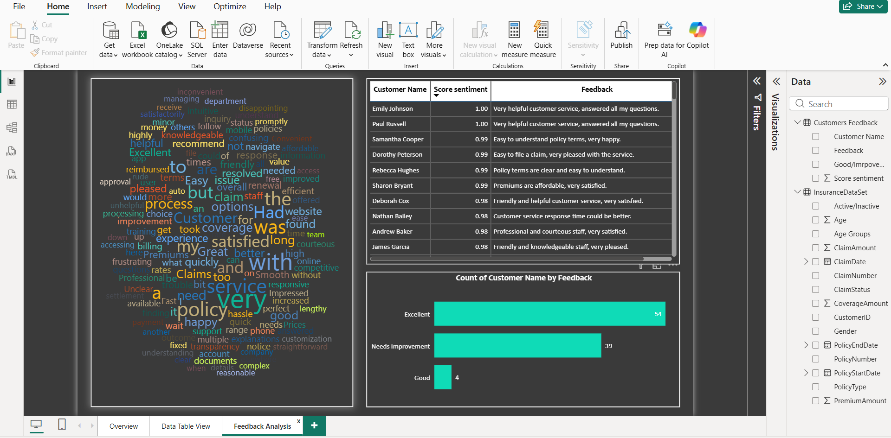

# Pyramid Insurance – Policy, Claims & Customer Feedback Dashboard 🛡️

## 1. Overview
Developed a comprehensive Power BI dashboard to analyze the core insurance lifecycle metrics (Policy, Premium, Claims) and integrate them with customer feedback data. The goal was to provide a holistic view of portfolio performance and customer satisfaction drivers.

## 🖼️ Policy and Risk Overview
This primary view provides an executive summary of the firm's exposure and volume. Key metrics displayed include **Total Coverage Amount**, **Policy Count**, and **Average Premium**, allowing management to quickly assess portfolio health and growth.

**

[Image of Insurance Policy Overview]
**

## 2. Claims Analysis and Data Integrity
Claims processing requires absolute data fidelity. This section validates the underlying data model, linking claims, policy details, and payments.

* **Key Skill Highlight:** Demonstration of clean data structure, successful ETL, and the implementation of complex SQL/DAX to resolve data lineage issues.
* **Key Metrics Tracked:** **Claims Ratio** and **Loss Ratio** by policy type and region.

****

## 3. Customer Satisfaction and Future Risk
This unique section correlates claims experience with customer feedback scores. The goal is to proactively identify policy types and regions where low satisfaction may indicate future claim risk or high churn potential.

* Analyzes sentiment trends based on claims settlement speed and outcome.
* Identifies segments for targeted retention efforts.

****

---

### 🎯 Goal
To enable stakeholders to monitor claims frequency and severity across different policy types and regions, identifying high-risk segments and linking policy performance to customer sentiment.

## 2. Tools & Technologies
- **Business Intelligence:** Microsoft Power BI
- **DAX:** Data Analysis Expressions (for custom policy/claims metrics)
- **Data Modeling:** Star/Snowflake Schema to link Policy, Claims, and Customer Feedback tables.
- **Data Source:** POS CSV files (10k+ rows, 2024–2025 data)

## 3. Key Actions / Process (Metrics & Modeling)
- **Data Modeling:** Built a robust model to accurately connect policy issuance dates to subsequent claims and feedback events, ensuring correct time-series analysis.
- **Custom DAX Development:** Developed core insurance metrics, including:
    - **Premium Amount (MoM/YoY)**
    - **Total Coverage Amount**
    - **Total Claims Processed & Claims Ratio**
- **Claims Analysis:** Created drill-down visualizations to track claims severity (average claim value) and frequency by geographical region and customer segment.
- **Sentiment Integration:** Linked customer feedback data (e.g., ratings) back to the specific policy type to analyze satisfaction drivers related to coverage and claims handling.

## 4. Key Achievements & Results
- **Risk Identification:** Enabled the identification of **high-risk customer and policy segments** by correlating claim severity/frequency with geographical and demographic factors.
- **Business Insight:** Provided clarity on the **Claims Ratio**, allowing management to assess the profitability of different product lines.
- **Actionable Feedback:** Established a framework to link **customer sentiment** directly to operational outcomes, driving targeted improvements in service or policy structure.

## 5. View Project
- **Live Interactive Dashboard:** [Insert Your NovyPro or Tableau Public Link HERE]
- **Source File:** InsuranceDataPBI.pbix (Available in this repository)
